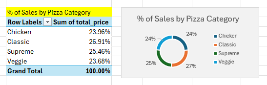
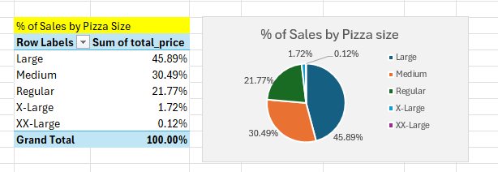
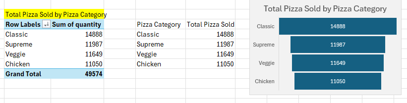
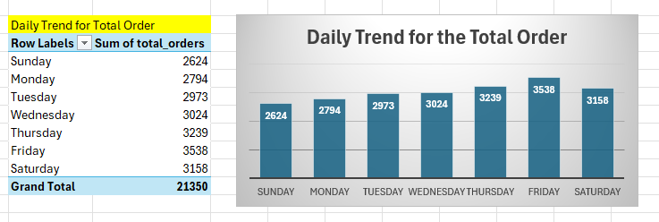
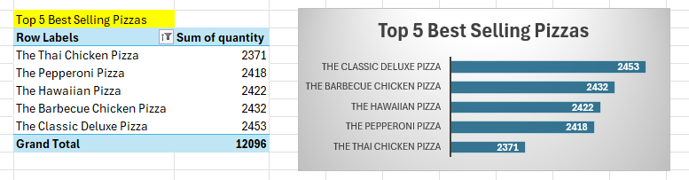
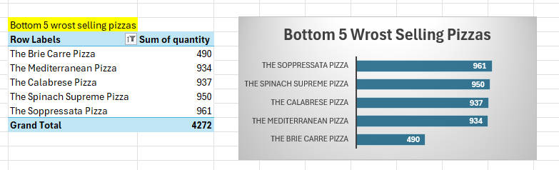
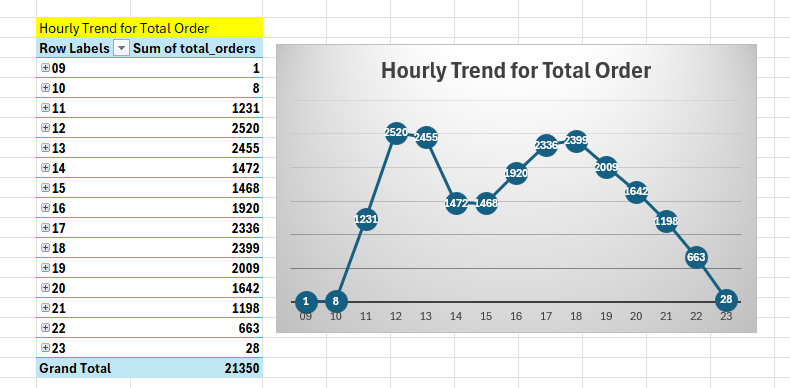

## 🍕 Pizza Sales Analysis

## 📌 Project Overview
This project analyzes **pizza sales data** using **SQL and Excel** to gain insights into sales performance, customer preferences, and business trends.  
The analysis involves:  
 - ✔️ Querying the dataset with **SQL** to extract key insights.  
 - ✔️ Validating results and creating visualizations in **Excel**.  
 - ✔️ Developing an **interactive dashboard** to showcase findings.  

## 🎯 Objectives
  - Perform data-driven analysis to understand sales performance.
  - Identify best-selling and least-selling pizzas to optimize inventory and marketing.
  - Analyze sales trends based on time of the day, pizza category, and pizza size.
  - Provide actionable insights for pricing, promotions, and product recommendations.
  - Build an interactive Excel dashboard for data visualization.

## 📊 Key Insights

### 🔹 **Sales Trends Analysis**
   - **Peak Sales Hours**: Highest orders during **lunch (12 PM - 1 PM) & dinner (5 PM - 6 PM)**.  
   - **Best Sales Days**: **Weekends (Saturday & Sunday)** have maximum sales.  
   - **Monthly Trends**: **Holiday seasons** boost sales significantly.  

### 🔹 **Pizza Performance**
   - **Top-Selling Pizzas**: Generate the highest revenue.  
   - **Low-Selling Pizzas**: Need **rebranding or discounts**.  

### 🔹 **Customer Preferences**
   - **Large pizzas contribute the most revenue**.  
   - **Classic & Chicken pizzas** are the most popular.  

### 🔹 **Revenue Insights**
   - **Total Revenue**: 💲 High revenue generated from large-sized pizzas.  
   - **Average Order Value (AOV)**: 📈 Customers prefer mid-to-premium priced pizzas.

## 🛠 Tools Used
 - SQL - Data Querying & Analysis
 - Excel - Data cleaning, Validation & Visualization
 - GitHub - Documentation & Version Control

## 📈 Visualizations

### **Sales Dashboard**

### **PCT(%)of Sales by Pizza category**

 Chicken and Classic category pizza has the highest percentage of sales among all other categories.

### **PCT(%) of Sales by Pizza size**

 Large and medium-sized pizzas have the highest sales percentage than other pizza types. 

### **Total Pizza sold by Pizza category**

 The classic category has the highest number of pizzas sold.

### **Daily Trends for Total Orders**

 weekends(Thusday/Friday/Saturday) pizza orders are highest among the normal days.

### **Top-Selling Pizzas**

### **Bottom 5 Selling Pizzas**

### **Hourly Trends for Total Orders**

 12:00 pm – 1:00 pm and 5:00 pm – 6:00 pm the pizza order is highest compared to the other times in the day.

## 💡 Business Recommendations
🔹 **Marketing Strategies**
    - Promote **weekend discounts & meal deals**.  
    - Bundle slow-moving pizzas with best-sellers to **increase demand**.  

🔹 **Inventory Optimization**
    - Stock up on **popular pizza ingredients**.  
    - Reduce orders for **least-selling pizzas** to cut waste.  

🔹 **Customer Experience**
    - Optimize **delivery efficiency** during peak hours.  
    - Use **loyalty rewards & personalized offers**.  

## 📌 Conclusion
This project provides data-driven insights to help optimize sales, improve marketing strategies, and enhance customer satisfaction.
By implementing these recommendations, businesses can boost revenue and minimize losses.
