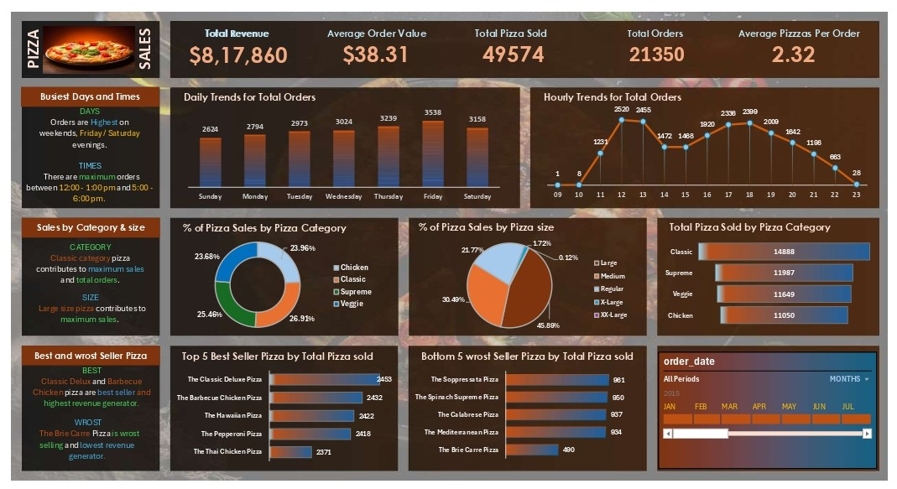

## 🍕 Pizza Sales Analysis

## 📌 Project Overview
This project analyzes **pizza sales data** using **SQL and Excel** to gain insights into sales performance, customer preferences, and business trends.  
The analysis involves:  
 - ✔️ Querying the dataset with **SQL** to extract key insights.  
 - ✔️ Validating results and creating visualizations in **Excel**.  
 - ✔️ Developing an **interactive dashboard** to showcase findings.  

## 🎯 Objectives
  - Perform data-driven analysis to understand sales performance.
  - Identify best-selling and least-selling pizzas to optimize inventory and marketing.
  - Analyze sales trends based on time of the day, pizza category, and pizza size.
  - Provide actionable insights for pricing, promotions, and product recommendations.
  - Build an interactive Excel dashboard for data visualization.

## 📊 Key Insights

### 🔹 **Sales Trends Analysis**
- **Peak Sales Hours**: Highest orders during **lunch (12 PM - 1 PM) & dinner (5 PM - 6 PM)**.  
- **Best Sales Days**: **Weekends (Saturday & Sunday)** have maximum sales.  
- **Monthly Trends**: **Holiday seasons** boost sales significantly.  

### 🔹 **Pizza Performance**
- **Top-Selling Pizzas**: Generate the highest revenue.  
- **Low-Selling Pizzas**: Need **rebranding or discounts**.  

### 🔹 **Customer Preferences**
- **Large pizzas contribute the most revenue**.  
- **Classic & Chicken pizzas** are the most popular.  

### 🔹 **Revenue Insights**
- **Total Revenue**: 💲 High revenue generated from large-sized pizzas.  
- **Average Order Value (AOV)**: 📈 Customers prefer mid-to-premium priced pizzas.

## 📈 Visualizations

### **Sales Dashboard**

### **Top-Selling Pizzas**

